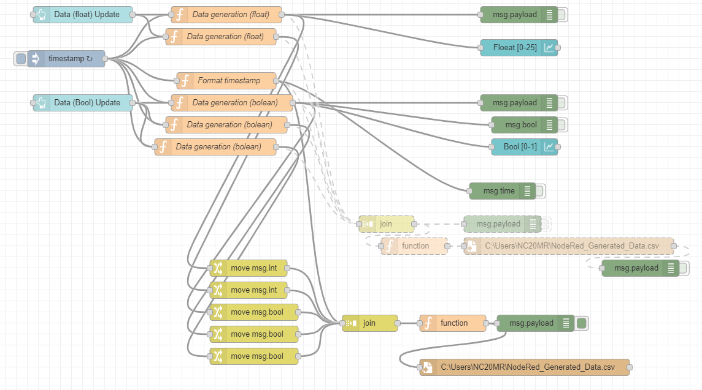
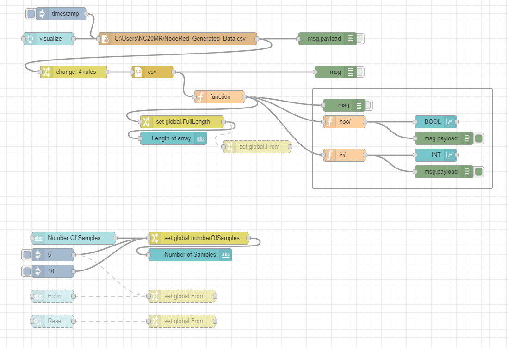
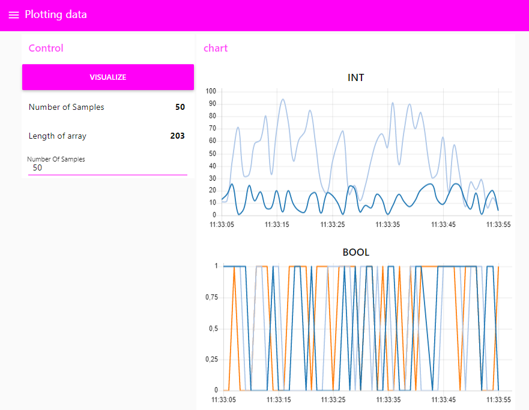

# Random data generator, writing to file, reading from file and plotting in UI
For playing with data visualisation
 
**NodeRed Version**
2.1.1

## The Flow

Generating data, remember to give a new path for the file location

Plotting data, remember to give the path to the generated file location

**The Node-RED Flow can be found under Code**

## The Dashboard 

UI access NODE-RED-ADRESS:1880/ui

**As always... Have fun with the data and code**
